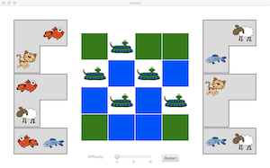
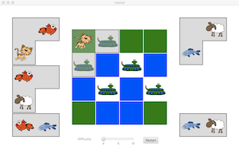
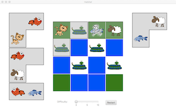
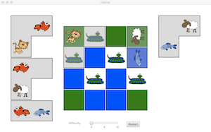
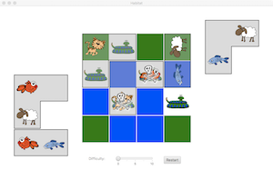
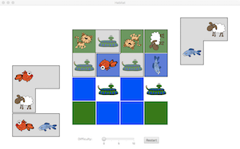
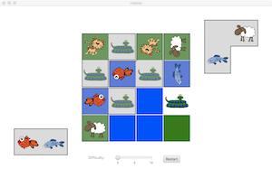
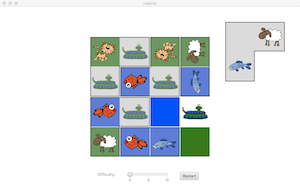
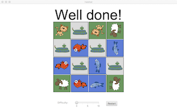

# COMP1110 Assignment 1

## Academic Honesty and Integrity

Honesty and integrity are of utmost importance. These goals are *not* at odds
with being resourceful and working collaboratively. You *should* be resourceful
and you should discuss the assignment
and other aspects of the course with others taking the class. However, *you must
never misrepresent the work of others as your own*. If you have taken ideas from
elsewhere or used code sourced from elsewhere, you must say so with *utmost
clarity*. At each stage of the assignment you will be asked to submit a statement
of originality, either as a group or as individuals. This statement is the place
for you to declare which ideas or code contained in your submission were sourced
from elsewhere.

Please read the ANU's [official position](http://academichonesty.anu.edu.au/) on
academic honesty. If you have any questions, please ask me.

Carefully review the [statement of originality](originality.md) which you must
complete.  Edit that statement and update it as you complete the assignment,
ensuring that when you complete the assignment, a truthful statement is committed
and pushed to your repo.

## Purpose

In this assignment is introductory, helping you gain familiarity with the basics
of Java, but doing so in the context of slightly larger piece of code.  Most
of the assignment is composed of a series of small tasks.

## Assignment Deliverable

The assignment is worth 5% of your total assessment, and it will be marked out
of 5. However, these marks are redeamable by the exam, so if your exam mark / 20
is higher than your assignment one mark, you will get the exam mark / 20 rather
than the assignment one mark. **The mark breakdown is described on the
[deliverables](https://gitlab.cecs.anu.edu.au/comp1110/comp1110/wikis/deliverables#d1a-assignment-1-5-marks-individual) page.**

The assignment is due at [12:45pm Friday](http://www.timeanddate.com/worldclock/fixedtime.html?msg=Assignment+1+Due&iso=20160805T0245&p1=%3A),
week 3 (you can find [this deadline](https://gitlab.cecs.anu.edu.au/comp1110/comp1110/wikis/deliverables#d1a-assignment-1-5-marks-individual)
on the [deliverables page](https://gitlab.cecs.anu.edu.au/comp1110/comp1110/wikis/deliverables), where all assignment deadlines for this semester are
listed).
Your work will be marked via
your tutor accessing GitLab, so it is essential that you carefully follow
instructions for setting up and maintaining your repository. You will be marked
according to whatever is committed to your repository at the time of the deadline.
Since the first assignment is redeemable and therefore optional, **late extentions
are not offered and will not be given**. As always, throughout the course, if
some significant circumstance arises outside of the course that you believe is
affecting your capacity to complete the course, please carefully follow the ANU's [special consideration process](http://www.anu.edu.au/students/program-administration/assessments-exams/special-assessment-consideration), and your circumstances will be accounted for in your final assessment.

## Overview

The assignment is based on a simple children's puzzle called [Camouflage](http://www.smartgames.eu/en/smartgames/camouflage-north-pole).
*(Actually, I based the assignment on an unnamed game which I've only just
discovered is a Chinese knock-off of [this great game](http://www.smartgames.eu/en/smartgames/camouflage-north-pole)
from the Netherlands' [Smart Games NV](http://www.smartgames.eu/en).)*

The game is played on a 4x4 grid, which we will refer
to as the *habitat*.  Each grid square consists of one of three habitat types:
*land*, *water*, and *predator*.  The game involves *creatures* which must be
placed within the habitat: *land animals* (cat and sheep), which must live on land,
and *fish* (blue fish, red fish), which must live in water.   Neither fish nor
land animals can live with a predator (a snake).

The game includes six transparent playing pieces: four 'L'-shaped tiles, which
cover three grid squares, and two 'I'-shaped tiles, which cover two grid squares.
Together the playing pieces cover sixteen squares (4x3 + 2x2).  Each playing piece
has a creature printed on one or more of its transparent plastic grid squares.

The player's job is to arrange the transparent playing pieces so that they
perfectly cover the four-by-four grid (with no overlaps, and every grid square
covered), while ensuring that creatures are only placed on friendly habitats
(so for example, a fish must not be on land, and no creature may be on a snake).

The images below show the progression of a simple game.

The game starts with a habitat on the board.  There are many possible habitats,
but the habitat must have only one solution.  Habitats can be of varying
difficulty.

The player then starts placing pieces.   They place a piece with a cat onto the
board so that the cat is on land, which is correct.

Notice that their second move places
the bottom right-most piece (fish and sheep) onto the top right of the board,
but this means that the fish is on land which is incorrect (a skull and cross
bones indicates the error).  

The player then rotates the piece 90 degrees into
the vertical position (using the scroll on the mouse) and the piece fits without
any problems.

In the next move, they incorrectly place the top left piece
(fish and cat).

They then rotate the piece until it fits correctly.  

In the 
remaining moves, they play all the other pieces, and eventually have the 
entire habitat covered by the six pieces without any errors, and the game
is over.   They can start a new game by selecting a difficulty level and
pressing the 'Restart' button.

### Your task

Unfortunately your version of the assignment has some missing code.   While the
graphical user interface is complete, some of the important logic is missing,
so it won't work quite as described above.  It is your job to fix the problems
so that it works.
	
## Legal and Ethical Issues

First, as with any work you do, you must abide by the principles of
[honesty and integrity](http://cs.anu.edu.au/courses/COMP1110/Integrity). I expect
you to demonstrate honesty and integrity in everything you do.

In addition to those ground rules, you are to follow the rules one would normaly
be subject to in a commercial setting. In particular, you may make use of the
works of others under two fundamental conditions: a) your use of their work must
be clearly acknowledged, and b) your use of their work must be legal (for example,
consistent with any copyright and licensing that applies to the given material).
**Please understand that violation of these rules is a very serious office.**
However, as long as you abide by these rules, you are explicitly invited to
conduct research and make use of a variety of sources. You are also given an
explicit means with which to declare your use of other sources (via originality
statements you must complete). It is important to realize that you will be
assessed on the basis of your original contributions to the project. While you
won't be penalized for correctly attributed use of others' ideas, the work of
others will not be considered as part of your contribution. Therefore, these
rules allow you to copy another student's work entirely if: a) they gave you
permission to do so, and b) you acknowledged that you had done so. Notice,
however, that if you were to do this you would have no original contribution and
so would recieve no marks for the assigment (but you would not have broken any
rules either).
	
## Evaluation Criteria

**The mark breakdown is described on the
[deliverables](https://gitlab.cecs.anu.edu.au/comp1110/comp1110/wikis/deliverables#d1a-assignment-1-5-marks-individual) page.**

**Pass**
* Tasks #1, #2, #3, #4, and #5

**Credit**
* Task #6 *(in addition to all tasks required for Pass)*

**Distinction**
* Task #7 *(in addition to all tasks required for Credit)*

**High Distinction**
* Tasks #8 and #9 *(in addition to all tasks required for Distinction)*

**IMPORTANT NOTE:** *It is very important that you understand that you are* **not** *required to complete all elements of the
assignment. In fact, you are not encouraged to pursue the Distinction and High
Distinction tasks unless you feel motivated and able to do so. Recall that the
assignment is redeemable against the exam. The last parts of the assignment are
significantly harder than the others, but together worth only one additional mark. I
don't encourage you to spend too much time on this unless you are enjoying the
challenge of solving these harder problems.  Solutions to tasks #8 and #9 may
involve ideas that I have not covered, or not covered deeply in class; you may
need to go beyond the course material.*
